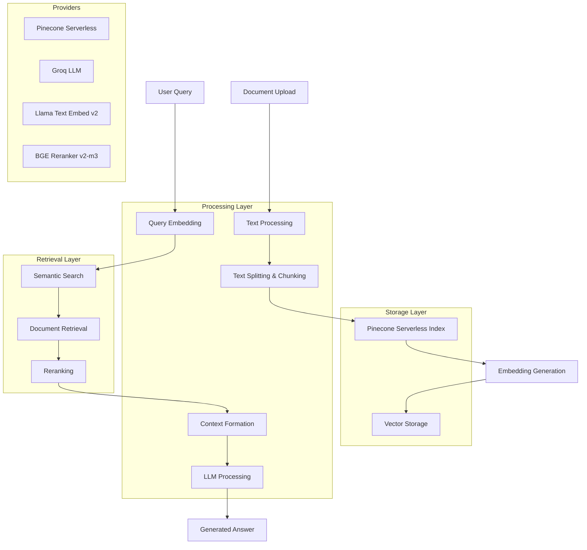

# 🔍 Mini RAG Assistant

A minimal yet powerful Retrieval-Augmented Generation (RAG) application built with Streamlit, featuring document processing, semantic search, and AI-powered question answering.

[](https://mini-rag-assistant-production.up.railway.app/)

## 🏗️ Architecture



## ⚙️ Technical Configuration

### **Text Chunking Parameters**
- **Chunk Size:** 1000 characters
- **Overlap:** 150 characters
- **Splitter:** RecursiveCharacterTextSplitter (LangChain)
- **Supported Formats:** PDF, TXT, Direct Text Input

### **Embedding & Storage**
- **Provider:** Pinecone Serverless (AWS us-east-1)
- **Embedding Model:** `llama-text-embed-v2`
- **Index Configuration:** Integrated embedding with automatic vector generation
- **Namespace:** `example-namespace`

### **Retrieval Settings**
- **Initial Retrieval:** Top-K = 5 documents
- **Reranker Model:** `bge-reranker-v2-m3`
- **Final Results:** Top-N = 3 most relevant chunks
- **Search Type:** Semantic similarity with reranking

### **Language Model**
- **Provider:** Groq
- **Model:** `meta-llama/llama-4-scout-17b-16e-instruct`
- **Features:** Fast inference, citation generation, context-aware responses

## 🛠️ Tech Stack

| Component | Provider/Library | Purpose |
|-----------|------------------|---------|
| **Frontend** | Streamlit | Web interface and user interaction |
| **Document Processing** | LangChain Community | PDF/TXT loading and text splitting |
| **Vector Database** | Pinecone Serverless | Embedding storage and semantic search |
| **Embeddings** | Llama Text Embed v2 | Text-to-vector conversion |
| **Reranking** | BGE Reranker v2-m3 | Result relevance optimization |
| **Language Model** | Groq (Llama 4 Scout) | Answer generation |
| **Deployment** | Railway/Streamlit Cloud | Cloud hosting |

## 🚀 Quick Start

### **Prerequisites**
- Python 3.8+
- Pinecone API Key
- Groq API Key

### **1. Clone Repository**
```bash
git clone https://github.com/sainiakhil/mini-rag-assistant.git
cd mini-rag-assistant
```

### **2. Install Dependencies**
```bash
pip install -r requirements.txt
```

### **3. Environment Setup**
Create a `.env` file in the project root:
```env
PINECONE_API_KEY=your_pinecone_api_key_here
GROQ_API_KEY=your_groq_api_key_here
```

### **4. Run Locally**
```bash
streamlit run app.py
```

Access the application at `http://localhost:8501`

## 📋 Project Structure

```
mini-rag-assistant/
├── app.py                 # Main Streamlit application
├── requirements.txt       # Python dependencies
├── Procfile              # Railway deployment config
├── railway.toml          # Railway-specific settings
├── .env.example          # Environment variables template
├── README.md             # Project documentation
└── .gitignore            # Git ignore rules
```

## 🔧 Configuration Details

### **Pinecone Index Configuration**
```python
pc.create_index_for_model(
    name="mini-rag",
    cloud="aws",
    region="us-east-1",
    embed={
        "model": "llama-text-embed-v2",
        "field_map": {"text": "chunk_text"}
    }
)
```

### **Retrieval and Reranking**
```python
reranked_docs = index.search(
    namespace="example-namespace",
    query={
        "top_k": 5,
        "inputs": {"text": query}
    },
    rerank={
        "model": "bge-reranker-v2-m3",
        "top_n": 3,
        "rank_fields": ["chunk_text"]
    }
)
 ```
---


## 🌐 Deployment

This project is deployed on **[Railway](https://railway.app/)** using the provided configuration files.

### **Deployment Setup**

1. Make sure you have a Railway account and the **Railway CLI** installed:

   ```bash
   npm i -g @railway/cli
   ```

2. Initialize the Railway project:

   ```bash
   railway init
   ```

3. Deploy the application using:

   ```bash
   railway up
   ```

### **Deployment Configuration**

The following files are included to streamline deployment on Railway:

* **`Procfile`** → Defines the process to run the Streamlit app (`web: streamlit run app.py --server.port=$PORT --server.address=0.0.0.0`)
* **`railway.toml`** → Contains Railway-specific project settings (environment, service name, etc.)
* **`requirements.txt`** → Lists all Python dependencies needed for the app to run

Once deployed, Railway automatically assigns a live URL where your RAG assistant will be accessible.


## 📊 Performance Metrics

The application provides real-time metrics:
- **Response Time:** End-to-end query processing time
- **Token Usage:** Input/output token counts for cost estimation
- **Cost Estimation:** Approximate API costs based on token usage

### **Expected Performance**
- **Document Processing:** 2-10 seconds (depends on size)
- **Query Response:** 1-3 seconds
- **Supported Document Size:** Up to 10MB per file

## 🔐 Environment Variables

| Variable | Description | Required |
|----------|-------------|----------|
| `PINECONE_API_KEY` | Pinecone API authentication | Yes |
| `GROQ_API_KEY` | Groq LLM API authentication | Yes |

## 🛡️ Security & Limitations

### **Security Features**
- Environment-based API key management
- No data persistence beyond session
- Automatic temporary file cleanup

### **Current Limitations**
- Single document processing at a time
- English-optimized (model dependent)
- Session-based storage (no persistence)
- Free tier API rate limits apply

## 🔄 API Rate Limits & Costs

### **Pinecone Serverless**
- **Free Tier:** Limited requests/month
- **Cost:** Pay per operation after free tier

### **Groq**
- **Free Tier:** Limited tokens/day
- **Models:** Fast inference with competitive pricing
---

**Made with ❤️ using Streamlit, Pinecone, and Groq**

*For the latest updates and features, star ⭐ this repository!*
